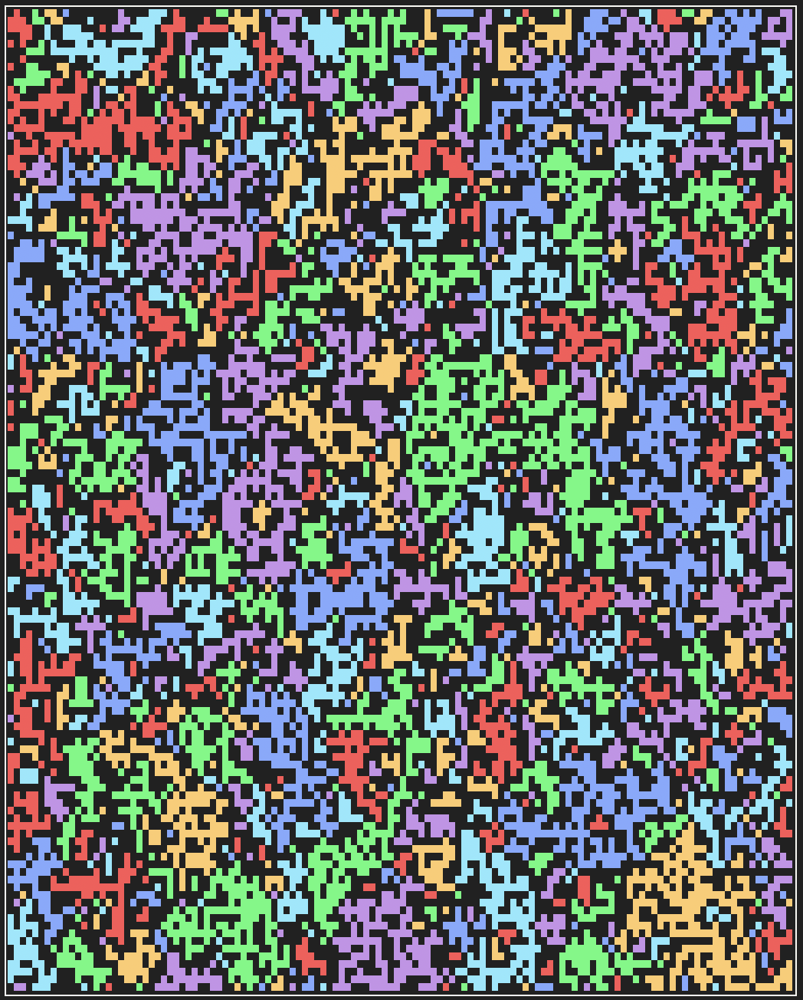

# Oh boy, here we go!

I needed to reuse so much from what I had before! First of all, the KnotHash
implementation was done in the solution itself, so I had to extract the builder
and keep backward compatibility, to allow to get the sparse hash and other stuff
to run the samples. But ok, that’s done.

And then came the cartography realm. I added a bunch of improvements:

* Maps can now index their individual points by `Point` object, so it’s easier
  to reason about them and interact with other parts of the system
* `LineDrawing` can now be created between two arbitrary points, which will be
  useful for the following:
* Map can now use pretty box drawing characters for nicer visualizations. I even
  created a separate terminal profile with font height cut in half, so the proportions
  end up nicer!
* `Path` can close on itself, and encircle an area! This is done to frame maps!

```
 Given a map:
 
             ┌────┐
    ##.#     │##.#│
    .#.#  →  │.#.#│
    #.#.     │#.#.│
             └────┘
```

## Back to the challenge

Solution for part I was easy as pie, given how we’ve got all this mapping technology.
The second part was easy as well: we did group finding in [Digital Plumbing](../D12/Readme.md).
I was thinking about reusing the code, but it was simple enough that I just copied and
made some improvements. For instance, the search is now a generator, and it yields
the intermediate states while exploring the group.

And then comes the visualizer!

## Visualizations

The idea was simple: every step of group finding will be plotted with a color. And then,
once the search is complete, I remove the group entirely to search for next ones. This is
how it looks:

<video src="https://raw.githubusercontent.com/mlebkowski/advent-of-code-php/main/src/Solutions/Y2017/D14/assets/defrag.mov" />

I know, everyone likes to admire disk defragmentator at work. But how about if instead of
removing the groups accounted for, we color them instead?


