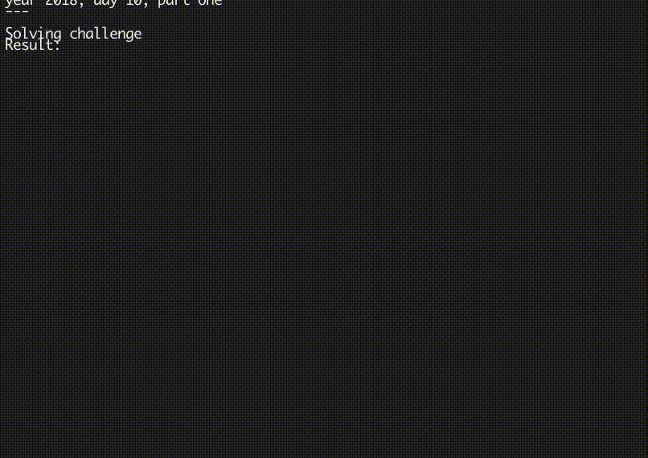

# When the stars align

The goal was to — you guessed it — use the cartography realm to iterate over
the star positions. It worked well for sample data, but in the real challenge
the star’s initial position was much further apart.

So the first goal was to advance the stars until they were closer together.
I decided that I wanted to find an area of arbitrary size: `sqr(stars) * 5`.
And then I realized it would take me tens of thousands of iterations to get
there. So I needed a faster approach.

I struggled a bit to find a good function that would advance the stars fast
enough, but not overshoot the „blink and you miss it” moment. I fiddled a
little with `ln($diff)` and variations, but it turned out that `sqrt(diff)`
simply works.

Ok, so I had my target area, and stars thereabout. Some normalization was
required to translate this area from somewhere in outer space to the center,
since maps are always anchored at 0×0. Then, for the animation’s sake,
I backpedaled a bit, so the stars would get out of the frame, and started
the animation:

It worked flawlessly. But I wanted to take a photo of the aligned stars.
There must be some kind of heuristic for the algo to determine the exact
frame! It turns out, it follows these two conditions:

* All of the stars are in the specified region (i.e. they all arrived)
* And they are all packed in a smallest area — they’ve come as close together
  as possible, and on the next frame they’ll start going further apart

And that just works. I copy the map at that second (take a photo) and frame it.