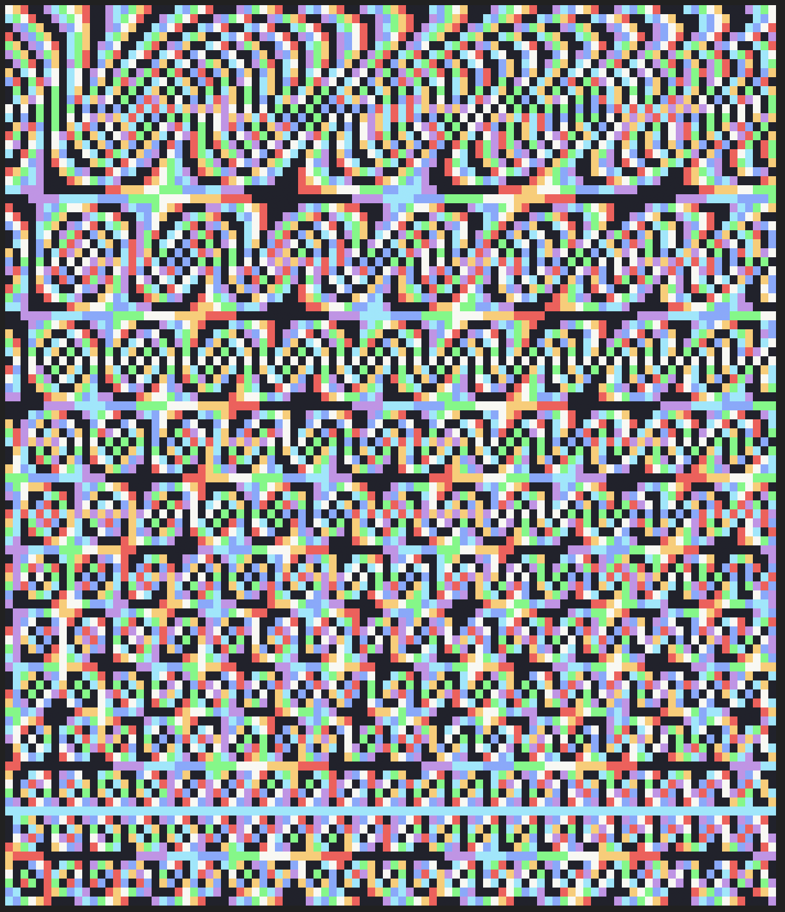

# Optimization

My first solitions are rather always readable, but not performant. With a little
help of reddit I refactored the solution using the
[Summed-area Table algo](https://www.wikiwand.com/en/Summed-area_table) and it
went much faster with much less memory required.

Before I brute-forced the solution, I thought that there might be a pattern
to how the power is distributed throughout the grid. While nice-looking, that
was a dead end.

